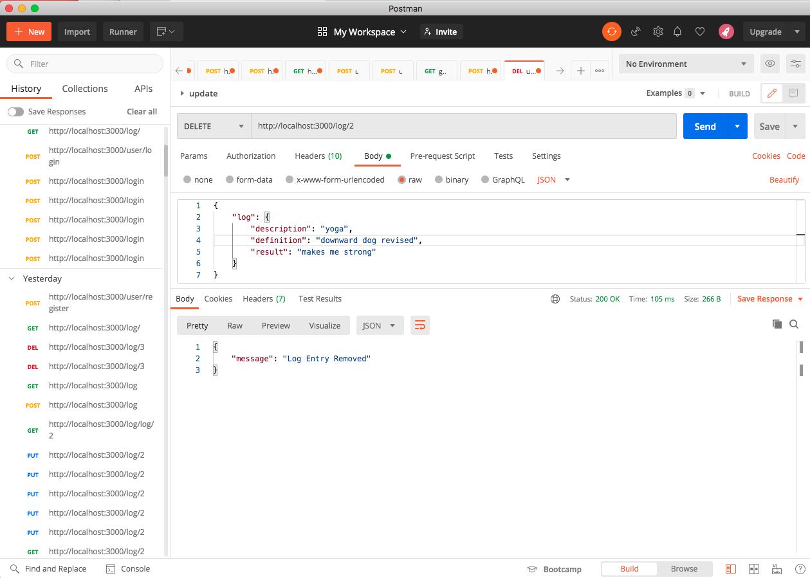

# Workout Log

### Endpoints:

#### 1.  /user/register • POST • Create user with username and password.

#### 2.  /user/login • POST • Login with existing user.

#### 3. /log/ • POST • Allows users to create workout logs.

#### 4.  /log/ • GET • Gets all logs for an individual user.

#### 5.   /log/:id • GET • Gets all logs for an individual user by id.

#### 6.  /log/:id • PUT • Allows logs to be updated by user.

#### 7.  /log/:id • DELETE • Allows logs to be deleted by user.

